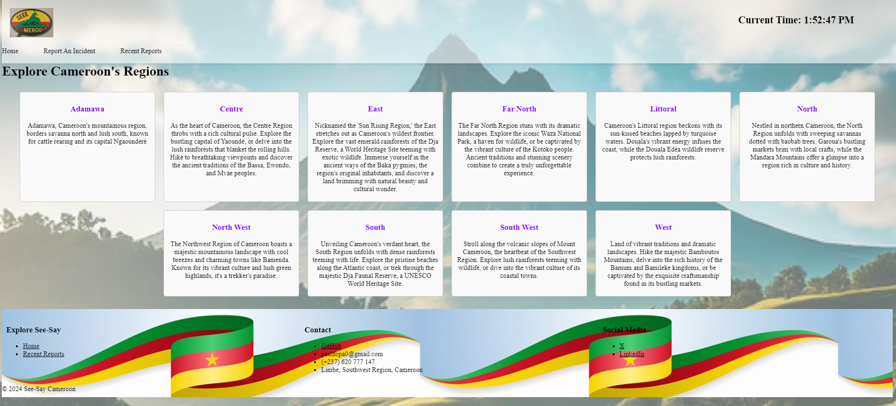

# See-Say Cameroon

Welcome to the See-Say cameroon project! This documentation serves as a comprehensive detailing of the project development process, functionalities, and future potential of this user-friendly platform designed to empower citizens in Cameroon to report incidents and contribute to a safer environment.

## Overview
See-Say Cameroon is a web-based application that allows users to see Cameroon's finest attractions, submit reports about various incidents they encounter in their communities. These incidents can range from security concerns and harassments to infrastructure issues and weather conditions. The platform aims to brigde the gap beterrn citizens and authorities by facilitating efficient and fostering improved communication.

## Core Functionalities

#### User-Friendly Interface.
See-Say Cameroon prioritizes a simple intuitive interface for easy incident reporting. Users can readily select the type of incident, provide detailed descriptions, and pinpoint their location with minimal effort.

#### Incident Reporting
Users can submit reports about a wide range of issues through a well-defined selection process. This empowers them to voice and contribute to a comprehensive picture of the situation in their commmunities

#### Location Selection
The website leverages an API to offer a dynamic location selection method. Users only need to make sure their location on their device used to access the application is turned on, then just click the button [Get Location]() on their incident report screen. This will generate the exact location of the user within milliseconds.

## Development Journey
Building See-Say Cameroon involved a series of crucial steps and valuable lessons learned.

#### Understanding User Needs:
The initial focus was on ensuring user-friendly experience. Features like a streamline interface, pre-defined incident categories and an easy-to-access location selection process were implemented.

#### Location Challenges:
Initially, a manual input of location by the user was considere. However, the possibility of mispelled locations and a particular place having more than one name meant that the platform will be rendering not so useful data. 

#### API Integration:
To overcome the limitaitons of manually typing a location, A location A API was explored and integrated. This allows the platform to dynamically generate the user's current location, ensuring a precise reporting of the user. This also helps for eye witness account, as you have to be in and around a locality for you to report an incident about the said area. A weather API was also integrated to help tourists see the current weather condition of a particular town in which they wish to visit and explore its touristic attractions.

#### Embracing Feedback:
The development process is not a one-time endeavor. We are committed to ongoing improvements based on user feedback and future needs.

## Technology Stack

#### Backend:
Python (Flask Framework)

#### - API Integration
- [Nominatim API](https://nominatim.org/release-docs/develop/) (for location)
- [Open weather wap API](https://openweathermap.org/) (for weather condition)

#### Frontend:
- HTML
- CSS
- JavaScript

#### - Database:
- MySQL

## Prerequisites
This section outlines the software and libraries required to run See-Say Cameroon effectively. Ensure you have the following before proceeding.

#### Installations

##### - Web Browser
##### - Python (version 3.x)
##### - pip
##### - Flask Framework
    pip install Flask
##### - MySQL Connector
    pip install mysql-connector

##### - Requests Library
    pip install requests

## Acknowledgments

I want to sincerely appreciate the following who made it possible for this project to be at the stage it is now.

##### Resources
 - [Python Documentation](https://docs.python.org/3/)
 - [Flask Mega Tutorial by Miguel](https://blog.miguelgrinberg.com/post/the-flask-mega-tutorial-part-i-hello-world)
 - Google Gemini
 - ChatGPT 3.5

##### Individuals
- [Juan Camilo](https://www.linkedin.com/in/juan-camilo-ochoa-zuluaga-779131113/). All the way from Columbia, a huge difference in time zone, but you still made sure you helped me develop this project. Forever grateful my friend, Juan
 - [T.F. Randy](https://github.com/TRANDY-116). We spent considerable amount of time on call, approximately 2 hours everyday, going through what has I had done daily, trying to see how to improve it. Merci mon frere.

 - [Labue Wilfred](https://twitter.com/labue_wilfred) Thanks for you continuos and never ending support. You alwasy reminded me that nothing is impossible. When I started this journey, you made sure my head was straight.

 - My wife, Maurelle for continuous motivation, even when I felt like giving up several times due to the difficulty of going through ALX.

##### - Community
 - [ALX](https://www.alxafrica.com/). I dreamed of becoming a software engineer, ALX took the bet on me and now, I can build web applications. Forver grateful to [Julien Barbier](https://twitter.com/julienbarbier42) and [Fred Swaniker](https://twitter.com/FredSwaniker)
